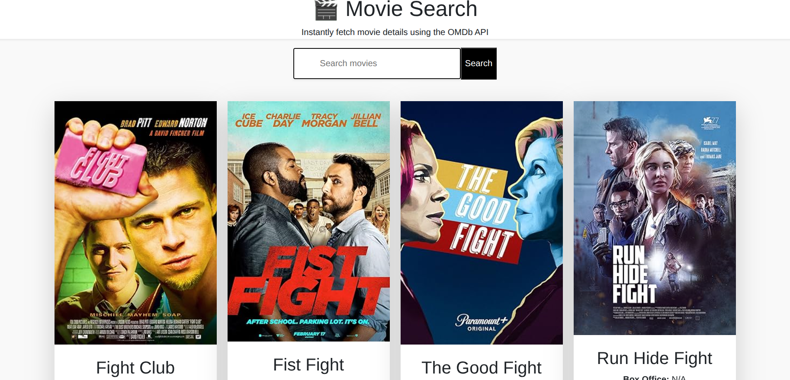

# 🎬 Demo Movie Search App

---

Welcome to **Demo** — a sleek, React-powered movie search application that fetches movie details from the [OMDb API](https://www.omdbapi.com/). Built with **Vite** for blazing-fast development and **React Hook Form** for elegant forms.

---

## 🚀 Features

- 🔍 Instant movie search by IMDb ID
- 💅 Clean, responsive UI with Bootstrap 5
- ⚛️ React Hooks and functional components
- 🧠 Form validation via React Hook Form
- ⏳ Loading and error states for smooth UX
- ⚡ Lightning-fast dev experience with Vite
- ✅ ESLint integration for clean code

---

## 🛠️ Tech Stack

| Tech               | Version    | Purpose                  |
|--------------------|------------|---------------------------|
| [React](https://reactjs.org/)              | ^18.2.0    | UI framework               |
| [React Hook Form](https://react-hook-form.com/) | ^7.45.2    | Form handling              |
| [Bootstrap](https://getbootstrap.com/)        | ^5.3.0     | Styling framework          |
| [Vite](https://vitejs.dev/)                  | ^4.4.0     | Build tool & dev server    |
| [ESLint](https://eslint.org/)                | ^8.44.0    | Code linting               |

---

